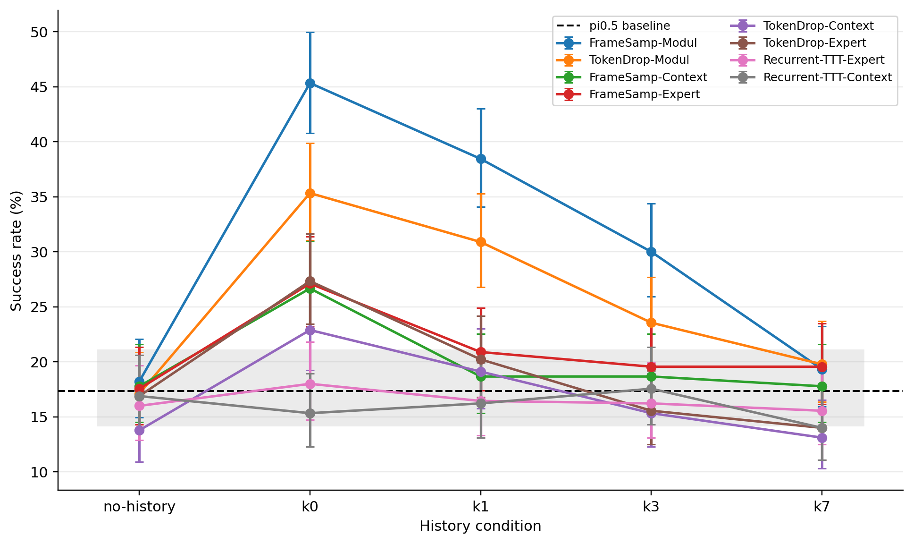

# Benchmarking Robot Memory Under Interference

[](https://arxiv.org/abs/2606.22338) [](https://robotmemorybench.com)

A cross-session benchmark for memory-augmented vision-language-action policies.

Robots that run for days accumulate experience across many sessions, users, and tasks. A useful memory system has to hold onto a relevant past session even when unrelated sessions pile up in between. This benchmark measures that directly: it places a relevant *lesson* session in the policy's history, inserts *k* unrelated distractor sessions after it, and tests whether the policy can still use the lesson to solve the current task.

It is built directly on **[RoboMME](https://robomme.github.io/)** (Dai et al., ICML 2026). We use RoboMME's tasks, π₀.₅ checkpoints, and released memory-augmented variants; we add the cross-session interference protocol, the evaluation grid, and the analysis.



Memory helps most when the lesson is the most recent session (`k0`) and decays back toward the no-memory baseline as distractor sessions push it back. Explore it interactively at **[robotmemorybench.com](https://robotmemorybench.com)**.

- **Website:** https://robotmemorybench.com
- **Paper:** [arXiv:2606.22338](https://arxiv.org/abs/2606.22338) — the full method and protocol
- **Data:** [`results/canonical_rollouts.csv`](results/canonical_rollouts.csv) — every rollout, the source of truth

## At a glance

- **Conditions:** `no-history`, `k0`, `k1`, `k3`, `k7` — the number of unrelated sessions sitting between the lesson and the query.
- **Grid:** 9 task families × 9 systems × 5 conditions × 50 episodes = **18,450 rollouts** (369 / 369 cells complete).
- **Finding:** perceptual memory systems improve success sharply when the relevant session is recent, then decay to the no-memory baseline as unrelated sessions accumulate. Recurrent variants stay flat throughout.

## Headline result

Success rate (%) by history condition. π₀.₅ is the no-memory floor.

| System | No history | k0 | k1 | k3 | k7 |
| --- | ---: | ---: | ---: | ---: | ---: |
| π₀.₅ (baseline) | 17.3 | – | – | – | – |
| FrameSamp-Modul | 18.2 | **45.3** | 38.4 | 30.0 | 19.3 |
| TokenDrop-Modul | 17.1 | 35.3 | 30.9 | 23.6 | 19.8 |
| FrameSamp-Context | 17.8 | 26.7 | 18.7 | 18.7 | 17.8 |
| FrameSamp-Expert | 17.6 | 27.1 | 20.9 | 19.6 | 19.6 |
| TokenDrop-Context | 13.8 | 22.9 | 19.1 | 15.3 | 13.1 |
| TokenDrop-Expert | 16.9 | 27.3 | 20.2 | 15.6 | 14.0 |
| Recurrent-TTT-Expert | 16.0 | 18.0 | 16.4 | 16.2 | 15.6 |
| Recurrent-TTT-Context | 16.9 | 15.3 | 16.2 | 17.6 | 14.0 |

Per-cell Wilson 95% intervals are in [`results/analysis/tables/main_success_rates.csv`](results/analysis/tables/main_success_rates.csv).

## Results

- **Perceptual memory helps when the relevant session is recent.** FrameSamp-Modul is strongest, rising from 18.2% with no history to 45.3% at `k0`; TokenDrop-Modul rises from 17.1% to 35.3%, against the 17.3% π₀.₅ baseline.
- **The benefit decays as unrelated sessions accumulate.** Both fall back to the baseline by `k7` — FrameSamp-Modul to 19.3%, TokenDrop-Modul to 19.8%.
- **Frame sampling is more robust than token dropping** across every condition.
- **Recurrent memory stays flat.** The TTT variants track the π₀.₅ baseline throughout.
- **The signal is clearest where the policy can already act.** The lift concentrates on easy and medium tasks (FrameSamp-Modul 38.0% and 28.5%, vs π₀.₅ 20.9% and 13.9%); hard tasks stay near the floor (15.2% vs 13.0%).

Full tables and figures are in [`results/analysis/`](results/analysis).

## Repository layout

```text
.
├── index.html, research.css, showcase.js   # project website (served via GitHub Pages)
├── results/
│   ├── canonical_rollouts.csv               # 18,450 rollouts — source of truth
│   ├── coverage.csv, grid_summary.csv, by_family_condition.csv, by_difficulty.csv
│   ├── MANIFEST.json, SHA256SUMS, README.md
│   └── analysis/                            # generated tables, figures, and README
├── scripts/
│   ├── analyze_cross_session_results.py     # rebuild the analysis package
│   └── create_cross_session_protocol_figure.py
└── assets/                                  # figures and showcase videos
```

## Reproducing

Requires Python 3.10+ with `pandas`, `numpy`, and `matplotlib`.

```bash
# Rebuild the analysis tables and figures from the canonical rollouts
python3 scripts/analyze_cross_session_results.py --results-dir results

# Regenerate the protocol diagram (assets/protocol_diagram.png)
python3 scripts/create_cross_session_protocol_figure.py

# Serve the website locally (then open http://localhost:8000)
python3 -m http.server 8000
```

Simulator checkpoints, raw rollout videos, and per-step action traces are not redistributed here — they come from [RoboMME](https://robomme.github.io/).

## License

Code, scripts, and website source are released under Apache-2.0 ([`LICENSE`](LICENSE)); result CSVs, tables, and figures under CC BY 4.0 ([`LICENSES/CC-BY-4.0.txt`](LICENSES/CC-BY-4.0.txt)). The paper is published separately on arXiv.

## Citation

If you use this benchmark, please cite it ([`CITATION.cff`](CITATION.cff)) and cite RoboMME, which it builds on.
