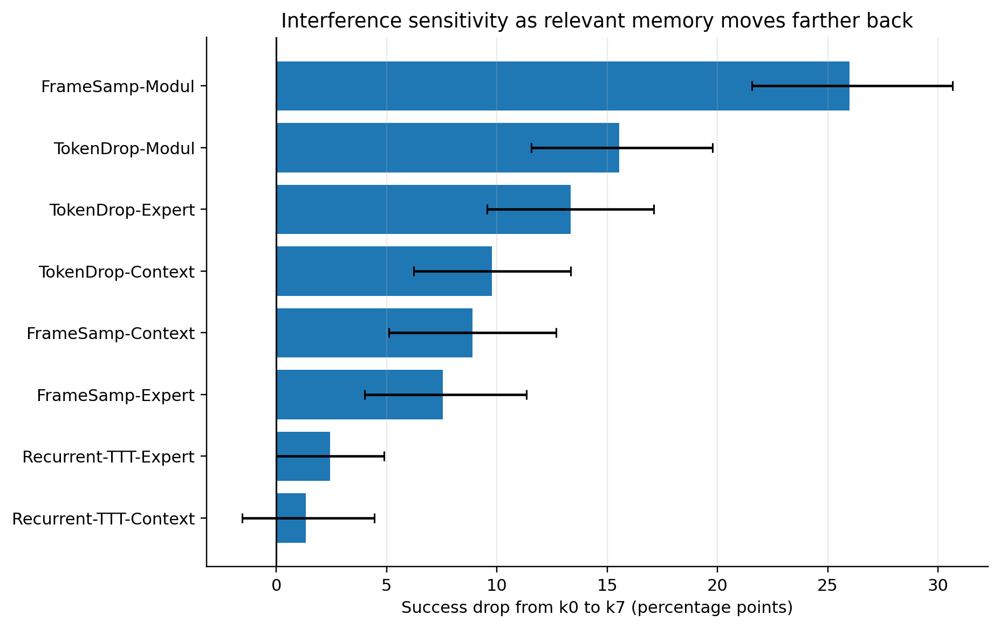
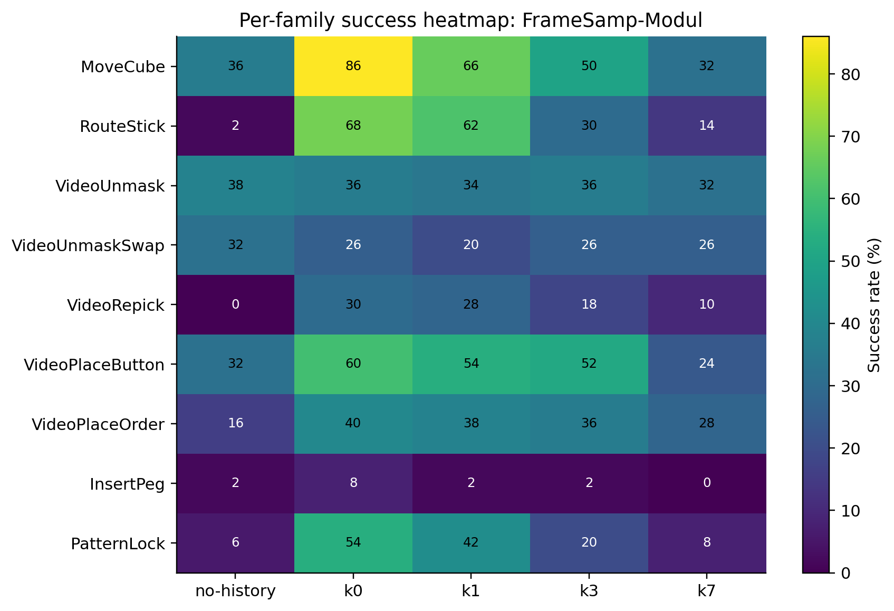

# Results

## Summary

The main empirical pattern is clear:

- FrameSamp-Modul has the strongest near-session memory benefit.
- TokenDrop-Modul is the second strongest perceptual variant.
- Memory benefit decays as the relevant lesson is pushed behind unrelated distractor sessions.
- Recurrent TTT variants are mostly flat in this benchmark.

## Main Success Rates

| System | No history | k0 | k1 | k3 | k7 |
| --- | ---: | ---: | ---: | ---: | ---: |
| pi0.5 baseline | 17.3% | - | - | - | - |
| FrameSamp-Modul | 18.2% | 45.3% | 38.4% | 30.0% | 19.3% |
| TokenDrop-Modul | 17.1% | 35.3% | 30.9% | 23.6% | 19.8% |
| FrameSamp-Context | 17.8% | 26.7% | 18.7% | 18.7% | 17.8% |
| FrameSamp-Expert | 17.6% | 27.1% | 20.9% | 19.6% | 19.6% |
| TokenDrop-Context | 13.8% | 22.9% | 19.1% | 15.3% | 13.1% |
| TokenDrop-Expert | 16.9% | 27.3% | 20.2% | 15.6% | 14.0% |
| Recurrent-TTT-Expert | 16.0% | 18.0% | 16.4% | 16.2% | 15.6% |
| Recurrent-TTT-Context | 16.9% | 15.3% | 16.2% | 17.6% | 14.0% |

Source: [`results/analysis/tables/main_success_rates.csv`](results/analysis/tables/main_success_rates.csv)

## Key Paired Effects

FrameSamp-Modul:

- `k0 - no-history`: +27.1 percentage points, bootstrap CI +22.7 to +31.6.
- `k1 - no-history`: +20.2 percentage points, bootstrap CI +15.8 to +24.9.
- `k3 - no-history`: +11.8 percentage points, bootstrap CI +7.8 to +15.8.
- `k7 - no-history`: +1.1 percentage points, bootstrap CI -2.2 to +4.4.
- `k7 - k0`: -26.0 percentage points, bootstrap CI -30.7 to -21.6.

TokenDrop-Modul:

- `k0 - no-history`: +18.2 percentage points, bootstrap CI +14.0 to +22.4.
- `k1 - no-history`: +13.8 percentage points, bootstrap CI +9.8 to +17.8.
- `k3 - no-history`: +6.4 percentage points, bootstrap CI +2.9 to +10.0.
- `k7 - no-history`: +2.7 percentage points, bootstrap CI -0.4 to +5.8.
- `k7 - k0`: -15.6 percentage points, bootstrap CI -19.8 to -11.6.

Source: [`results/analysis/tables/paired_bootstrap_comparisons.csv`](results/analysis/tables/paired_bootstrap_comparisons.csv)

## Figures

Headline success curve:

Interference drop:

Per-family heatmap for FrameSamp-Modul:

## Data Files

- [`results/canonical_rollouts.csv`](results/canonical_rollouts.csv): per-rollout results.
- [`results/MANIFEST.json`](results/MANIFEST.json): coverage and source manifest.
- [`results/coverage.csv`](results/coverage.csv): completed cells.
- [`results/analysis/tables`](results/analysis/tables): analysis tables.
- [`results/analysis/figures`](results/analysis/figures): generated plots.

